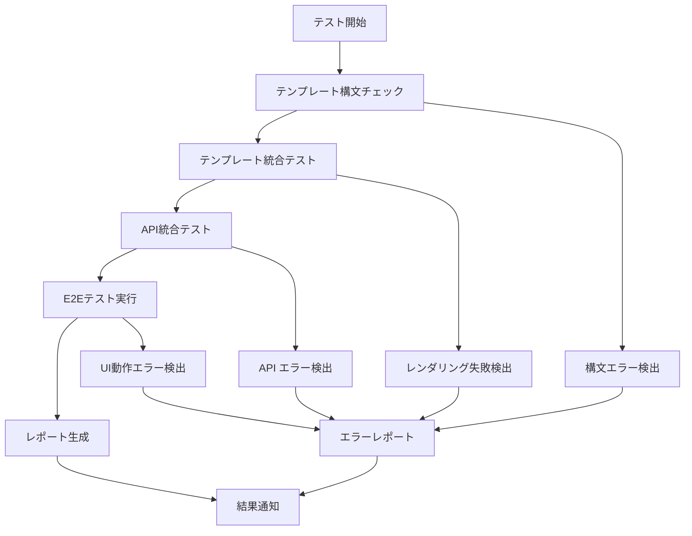

# Design Document

## Overview

フロントエンドテスト自動化システムは、Webアプリケーションのフロントエンド機能を包括的にテストするためのシステムです。今回のプロジェクト一覧ページで発生した「テンプレートブロック名の不一致によるJavaScript未実行」のような問題を自動検出し、開発効率を向上させます。

## Architecture

### システム構成

```
frontend-testing-automation/
├── tests/
│   ├── template/           # テンプレート統合テスト
│   ├── api/               # API統合テスト
│   ├── e2e/               # E2Eテスト（Playwright）
│   └── syntax/            # テンプレート構文チェック
├── utils/
│   ├── template_checker.py    # テンプレート検証ユーティリティ
│   ├── api_tester.py         # API テストユーティリティ
│   └── report_generator.py   # レポート生成
├── config/
│   ├── playwright.config.js  # Playwright設定
│   └── test_config.py        # テスト設定
└── reports/               # テスト結果レポート
    ├── html/             # HTMLレポート
    ├── screenshots/      # スクリーンショット
    └── coverage/         # カバレッジレポート
```

### テスト実行フロー



## Components and Interfaces

### 1. Template Testing Module

#### TemplateChecker クラス
```python
class TemplateChecker:
    def __init__(self, app_context):
        self.app = app_context
        self.templates_dir = 'app/templates'
    
    def check_syntax(self) -> List[TemplateError]:
        """Jinjaテンプレートの構文チェック"""
        pass
    
    def check_block_inheritance(self) -> List[InheritanceError]:
        """ブロック継承の整合性チェック"""
        pass
    
    def check_required_blocks(self) -> List[MissingBlockError]:
        """必須ブロックの存在チェック"""
        pass
    
    def render_test(self, template_path: str) -> RenderResult:
        """テンプレートレンダリングテスト"""
        pass
```

#### TemplateIntegrationTester クラス
```python
class TemplateIntegrationTester:
    def test_page_rendering(self, url: str) -> PageRenderResult:
        """ページレンダリングテスト"""
        pass
    
    def test_javascript_inclusion(self, url: str) -> JSInclusionResult:
        """JavaScriptブロックの包含テスト"""
        pass
    
    def test_css_inclusion(self, url: str) -> CSSInclusionResult:
        """CSSブロックの包含テスト"""
        pass
```

### 2. API Testing Module

#### APITester クラス
```python
class APITester:
    def __init__(self, test_client):
        self.client = test_client
    
    def test_datatables_api(self, endpoint: str) -> DataTablesResult:
        """DataTables API テスト"""
        pass
    
    def test_pagination(self, endpoint: str) -> PaginationResult:
        """ページネーションテスト"""
        pass
    
    def test_sorting(self, endpoint: str) -> SortingResult:
        """ソート機能テスト"""
        pass
    
    def test_search(self, endpoint: str) -> SearchResult:
        """検索機能テスト"""
        pass
    
    def test_error_handling(self, endpoint: str) -> ErrorHandlingResult:
        """エラーハンドリングテスト"""
        pass
```

### 3. E2E Testing Module (Playwright)

#### PlaywrightTester クラス
```python
class PlaywrightTester:
    def __init__(self, browser_type: str = 'chromium'):
        self.browser_type = browser_type
    
    async def test_page_load(self, url: str) -> PageLoadResult:
        """ページ読み込みテスト"""
        pass
    
    async def test_javascript_execution(self, url: str) -> JSExecutionResult:
        """JavaScript実行テスト"""
        pass
    
    async def test_user_interactions(self, url: str) -> InteractionResult:
        """ユーザーインタラクションテスト"""
        pass
    
    async def test_datatables_functionality(self, url: str) -> DataTablesE2EResult:
        """DataTables機能テスト"""
        pass
```

### 4. Report Generation Module

#### ReportGenerator クラス
```python
class ReportGenerator:
    def generate_html_report(self, results: List[TestResult]) -> str:
        """HTMLレポート生成"""
        pass
    
    def generate_json_report(self, results: List[TestResult]) -> dict:
        """JSONレポート生成"""
        pass
    
    def capture_screenshots(self, failed_tests: List[TestResult]) -> List[str]:
        """失敗テストのスクリーンショット取得"""
        pass
    
    def generate_coverage_report(self) -> CoverageReport:
        """テストカバレッジレポート生成"""
        pass
```

## Data Models

### TestResult データモデル
```python
@dataclass
class TestResult:
    test_name: str
    test_type: TestType  # TEMPLATE, API, E2E, SYNTAX
    status: TestStatus   # PASS, FAIL, SKIP
    duration: float
    error_message: Optional[str] = None
    screenshot_path: Optional[str] = None
    details: Optional[dict] = None
```

### TemplateError データモデル
```python
@dataclass
class TemplateError:
    template_path: str
    line_number: int
    error_type: str
    message: str
    suggestion: Optional[str] = None
```

### APITestResult データモデル
```python
@dataclass
class APITestResult:
    endpoint: str
    method: str
    status_code: int
    response_time: float
    data_validation: bool
    error_details: Optional[dict] = None
```

## Error Handling

### エラー分類
1. **構文エラー**: Jinjaテンプレートの構文問題
2. **継承エラー**: ブロック名の不一致や継承問題
3. **レンダリングエラー**: テンプレートレンダリング失敗
4. **APIエラー**: API応答の問題
5. **JavaScript実行エラー**: ブラウザでのJS実行失敗
6. **UI操作エラー**: ユーザーインタラクションの失敗

### エラー処理戦略
- **Graceful Degradation**: 一部のテストが失敗しても他のテストを継続
- **詳細ログ**: エラーの原因と修正方法を詳細に記録
- **スクリーンショット**: UI関連エラーの視覚的証拠を保存
- **リトライ機能**: ネットワーク関連の一時的エラーに対するリトライ

## Testing Strategy

### テスト実行レベル
1. **Unit Level**: 個別コンポーネントのテスト
2. **Integration Level**: コンポーネント間の連携テスト
3. **E2E Level**: エンドツーエンドのユーザーシナリオテスト

### テスト対象ページ
- ダッシュボード (`/`)
- プロジェクト一覧 (`/projects/`)
- プロジェクト新規作成 (`/projects/new`)
- プロジェクト編集 (`/projects/<id>/edit`)
- 支社一覧 (`/branches/`)
- 支社新規作成 (`/branches/new`)

### テストシナリオ例

#### プロジェクト一覧ページテスト
```python
async def test_projects_list_page():
    # 1. ページ読み込みテスト
    page_result = await test_page_load('/projects/')
    
    # 2. テンプレートレンダリングテスト
    template_result = test_template_rendering('projects/index.html')
    
    # 3. DataTables API テスト
    api_result = test_datatables_api('/projects/api/list')
    
    # 4. JavaScript実行テスト
    js_result = await test_javascript_execution('/projects/')
    
    # 5. ユーザーインタラクションテスト
    interaction_result = await test_search_functionality('/projects/')
    
    return combine_results([page_result, template_result, api_result, js_result, interaction_result])
```

## Performance Considerations

### テスト実行時間の最適化
- **並列実行**: 独立したテストの並列実行
- **テストデータの最適化**: 最小限のテストデータでの実行
- **ブラウザの再利用**: Playwrightブラウザインスタンスの再利用
- **選択的実行**: 変更されたファイルに関連するテストのみ実行

### リソース使用量の管理
- **メモリ使用量の監視**: 大量のテスト実行時のメモリリーク防止
- **ブラウザプロセスの管理**: 適切なブラウザプロセスのクリーンアップ
- **一時ファイルの管理**: スクリーンショットや一時ファイルの自動削除

## Security Considerations

### テストデータのセキュリティ
- **テスト専用データベース**: 本番データとの完全分離
- **機密情報の除外**: テストレポートからの機密情報除外
- **アクセス制御**: テスト結果へのアクセス制御

### CI/CD統合時のセキュリティ
- **環境変数の管理**: 機密情報の環境変数での管理
- **テスト結果の保護**: テスト結果の適切な保存と共有

## Deployment and CI/CD Integration

### GitHub Actions統合例
```yaml
name: Frontend Tests
on: [push, pull_request]

jobs:
  frontend-tests:
    runs-on: ubuntu-latest
    steps:
      - uses: actions/checkout@v3
      - name: Setup Python
        uses: actions/setup-python@v4
        with:
          python-version: '3.9'
      - name: Install dependencies
        run: |
          pip install -r requirements.txt
          playwright install
      - name: Run Frontend Tests
        run: python -m pytest tests/frontend/ --html=reports/report.html
      - name: Upload Test Results
        uses: actions/upload-artifact@v3
        with:
          name: test-results
          path: reports/
```

### ローカル開発環境での実行
```bash
# 全テスト実行
python -m pytest tests/frontend/

# 特定のテストタイプのみ実行
python -m pytest tests/frontend/template/
python -m pytest tests/frontend/api/
python -m pytest tests/frontend/e2e/

# レポート生成付き実行
python -m pytest tests/frontend/ --html=reports/report.html --self-contained-html
```

## Monitoring and Alerting

### テスト結果の監視
- **成功率の追跡**: テスト成功率の時系列監視
- **実行時間の監視**: テスト実行時間の変化追跡
- **失敗パターンの分析**: 頻繁に失敗するテストの特定

### アラート設定
- **テスト失敗時の通知**: Slack/Email通知
- **パフォーマンス劣化の検出**: 実行時間の異常増加検出
- **カバレッジ低下の警告**: テストカバレッジの低下警告