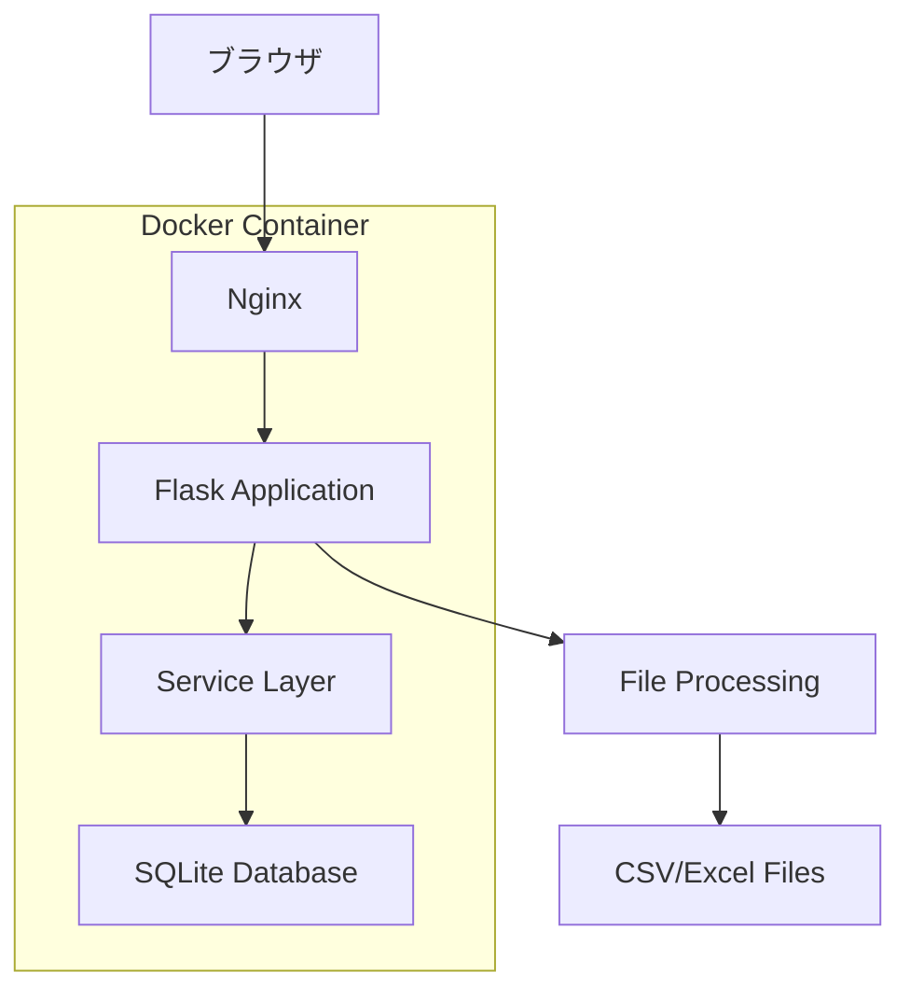

# 設計文書

## 概要

プロジェクト収支システムは、プロジェクトの売上・経費・粗利を管理するWebアプリケーションです。PythonのFlaskフレームワークを使用したMVCアーキテクチャで構築し、Docker化して本番環境にデプロイします。

## アーキテクチャ

### システム構成



### 技術スタック

- **フレームワーク**: Flask 2.3, Jinja2テンプレート
- **データベース**: SQLite3, SQLAlchemy ORM
- **ファイル処理**: pandas, openpyxl
- **フロントエンド**: AdminLTE 3.2, Bootstrap 4, jQuery
- **Webサーバー**: Nginx + Gunicorn
- **コンテナ**: Docker, Docker Compose
- **CI/CD**: GitHub Actions
- **テスト**: pytest, pytest-flask

## コンポーネントとインターフェース

### MVCアーキテクチャ

#### Model層
- **Project**: プロジェクトデータモデル（SQLAlchemy）
- **Branch**: 支社データモデル（SQLAlchemy）
- **データベース操作**: CRUD操作の実装

#### View層（テンプレート）
- **base.html**: AdminLTE基本レイアウト
- **dashboard.html**: ダッシュボード画面（統計カード、チャート）
- **projects/index.html**: プロジェクト一覧画面（DataTables）
- **projects/form.html**: プロジェクト入力・編集画面
- **branches/index.html**: 支社一覧画面（DataTables）
- **branches/form.html**: 支社入力・編集画面
- **import_export.html**: インポート・エクスポート画面
- **components/**: 再利用可能なコンポーネント

#### Controller層（ルート）
- **main_routes.py**: ダッシュボード関連
- **project_routes.py**: プロジェクト管理関連
- **branch_routes.py**: 支社管理関連
- **file_routes.py**: インポート・エクスポート関連

#### Service層（ビジネスロジック）
- **ProjectService**: プロジェクト管理のビジネスロジック
- **BranchService**: 支社管理のビジネスロジック
- **FileService**: CSV/Excelファイル処理
- **DashboardService**: 統計情報の計算
- **ValidationService**: データ検証ロジック

### ルート設計

#### プロジェクト管理
```
GET    /                       # ダッシュボード
GET    /projects               # プロジェクト一覧
GET    /projects/new           # 新規作成フォーム
POST   /projects               # プロジェクト作成
GET    /projects/<id>          # プロジェクト詳細
GET    /projects/<id>/edit     # 編集フォーム
POST   /projects/<id>/update   # プロジェクト更新
POST   /projects/<id>/delete   # プロジェクト削除
```

#### 支社管理
```
GET    /branches               # 支社一覧
GET    /branches/new           # 新規支社作成フォーム
POST   /branches               # 支社作成
GET    /branches/<id>          # 支社詳細
GET    /branches/<id>/edit     # 支社編集フォーム
POST   /branches/<id>/update   # 支社更新
POST   /branches/<id>/delete   # 支社削除
POST   /branches/<id>/toggle   # 支社有効/無効切り替え
```

#### インポート・エクスポート
```
GET    /import                 # インポート画面
POST   /import/upload          # ファイルアップロード
POST   /import/preview         # プレビュー表示
POST   /import/execute         # インポート実行
GET    /export/csv             # CSV形式エクスポート
GET    /export/excel           # Excel形式エクスポート
```

#### API（Ajax用）
```
GET    /api/projects           # プロジェクト一覧（JSON）
GET    /api/dashboard/stats    # 統計情報（JSON）
GET    /api/branches           # 支社一覧（JSON）
GET    /api/branches/search    # 支社検索（JSON）
```

## データモデル

### 支社テーブル (branches)

| カラム名 | データ型 | 制約 | 説明 |
|---------|---------|------|------|
| id | INTEGER | PRIMARY KEY, AUTOINCREMENT | 支社ID |
| branch_code | VARCHAR(20) | UNIQUE, NOT NULL | 支社コード |
| branch_name | VARCHAR(100) | UNIQUE, NOT NULL | 支社名 |
| is_active | BOOLEAN | DEFAULT TRUE | 有効フラグ |
| created_at | DATETIME | DEFAULT CURRENT_TIMESTAMP | 作成日 |
| updated_at | DATETIME | DEFAULT CURRENT_TIMESTAMP | 更新日 |

### プロジェクトテーブル (projects)

| カラム名 | データ型 | 制約 | 説明 |
|---------|---------|------|------|
| id | INTEGER | PRIMARY KEY, AUTOINCREMENT | プロジェクトID |
| project_code | VARCHAR(50) | UNIQUE, NOT NULL | プロジェクトコード |
| project_name | VARCHAR(200) | NOT NULL | プロジェクト名 |
| branch_id | INTEGER | FOREIGN KEY (branches.id), NOT NULL | 支社ID |
| fiscal_year | INTEGER | NOT NULL | 売上の年度 |
| order_probability | DECIMAL(5,2) | CHECK (order_probability >= 0 AND order_probability <= 100) | 受注角度(%) |
| revenue | DECIMAL(15,2) | NOT NULL, CHECK (revenue >= 0) | 売上（契約金） |
| expenses | DECIMAL(15,2) | NOT NULL, CHECK (expenses >= 0) | 経費（トータル） |
| gross_profit | DECIMAL(15,2) | GENERATED ALWAYS AS (revenue - expenses) | 粗利（計算列） |
| created_at | DATETIME | DEFAULT CURRENT_TIMESTAMP | 作成日 |
| updated_at | DATETIME | DEFAULT CURRENT_TIMESTAMP | 更新日 |

### インデックス設計
```sql
-- 支社テーブル
CREATE INDEX idx_branches_branch_code ON branches(branch_code);
CREATE INDEX idx_branches_is_active ON branches(is_active);

-- プロジェクトテーブル
CREATE INDEX idx_projects_fiscal_year ON projects(fiscal_year);
CREATE INDEX idx_projects_project_code ON projects(project_code);
CREATE INDEX idx_projects_branch_id ON projects(branch_id);
CREATE INDEX idx_projects_created_at ON projects(created_at);
```

## エラーハンドリング

### バリデーション規則

#### プロジェクトデータ検証
- **project_code**: 必須、50文字以内、英数字とハイフンのみ、重複不可
- **project_name**: 必須、200文字以内
- **branch_id**: 必須、有効な支社IDであること
- **fiscal_year**: 必須、1900-2100の範囲
- **order_probability**: 必須、0-100の範囲
- **revenue**: 必須、0以上の数値
- **expenses**: 必須、0以上の数値

#### 支社データ検証
- **branch_code**: 必須、20文字以内、英数字とハイフンのみ、重複不可
- **branch_name**: 必須、100文字以内、重複不可
- **is_active**: 必須、真偽値

#### エラーレスポンス形式
```json
{
  "success": false,
  "error": {
    "code": "VALIDATION_ERROR",
    "message": "入力データに問題があります",
    "details": [
      {
        "field": "project_code",
        "message": "プロジェクトコードは必須です"
      }
    ]
  }
}
```

### エラーハンドリング戦略

#### フロントエンド
- **入力検証**: リアルタイムバリデーション
- **API エラー**: ユーザーフレンドリーなメッセージ表示
- **ネットワークエラー**: 再試行機能付きエラー表示

#### バックエンド
- **データベースエラー**: ログ記録とGenericエラーレスポンス
- **ファイル処理エラー**: 詳細なエラー情報をCSVで提供
- **システムエラー**: 500エラーとログ記録

## テスト戦略

### 単体テスト
- **Model テスト**: pytest でデータモデルのテスト
- **Service テスト**: ビジネスロジックの単体テスト
- **Route テスト**: pytest-flask でエンドポイントのテスト
- **ファイル処理テスト**: CSV/Excel処理のテスト

### 統合テスト
- **データベーステスト**: SQLAlchemy操作のテスト
- **フォームテスト**: WTForms バリデーションのテスト
- **ファイルアップロードテスト**: マルチパートフォームのテスト

### テストデータ
- **fixtures**: pytest fixtures でテストデータ管理
- **サンプルファイル**: テスト用CSV/Excelファイル
- **境界値テスト**: 最大値・最小値でのテスト

### UI/UX設計（AdminLTE）

#### ダッシュボード画面
- **統計カード**: 総プロジェクト数、総売上、総経費、総粗利
- **チャート**: Chart.js による年度別売上推移
- **最近の更新**: 最新プロジェクト一覧テーブル
- **クイックアクション**: 新規作成、インポート、エクスポートボタン

#### プロジェクト一覧画面
- **DataTables**: ソート、検索、ページネーション機能
- **アクションボタン**: 編集、削除、詳細表示
- **フィルター**: 年度、受注角度範囲での絞り込み
- **バルクアクション**: 複数選択での一括操作

#### フォーム画面
- **AdminLTE フォーム**: 統一されたデザイン
- **リアルタイム計算**: 粗利の自動計算表示
- **バリデーション**: クライアントサイド + サーバーサイド
- **ファイルアップロード**: ドラッグ&ドロップ対応

### CI/CD パイプライン
```yaml
# .github/workflows/ci.yml
name: CI/CD Pipeline
on: [push, pull_request]
jobs:
  test:
    runs-on: ubuntu-latest
    steps:
      - uses: actions/checkout@v3
      - name: Set up Python
        uses: actions/setup-python@v4
        with:
          python-version: '3.11'
      - name: Install dependencies
        run: pip install -r requirements.txt
      - name: Download AdminLTE
        run: |
          wget https://github.com/ColorlibHQ/AdminLTE/archive/v3.2.0.zip
          unzip v3.2.0.zip -d static/
      - name: Run tests
        run: pytest --cov=app --cov-report=xml
      - name: Upload coverage
        uses: codecov/codecov-action@v3
  
  docker:
    needs: test
    runs-on: ubuntu-latest
    steps:
      - uses: actions/checkout@v3
      - name: Build Docker image
        run: docker build -t project-revenue-system .
      - name: Test Docker container
        run: docker run --rm project-revenue-system pytest
```

### Docker構成

#### Dockerfile
```dockerfile
FROM python:3.11-slim
WORKDIR /app
COPY requirements.txt .
RUN pip install -r requirements.txt
COPY . .
EXPOSE 5000
CMD ["gunicorn", "--bind", "0.0.0.0:5000", "app:create_app()"]
```

#### docker-compose.yml
```yaml
version: '3.8'
services:
  web:
    build: .
    ports:
      - "80:80"
    volumes:
      - ./data:/app/data
    environment:
      - FLASK_ENV=production
  
  nginx:
    image: nginx:alpine
    ports:
      - "80:80"
    volumes:
      - ./nginx.conf:/etc/nginx/nginx.conf
    depends_on:
      - web
```